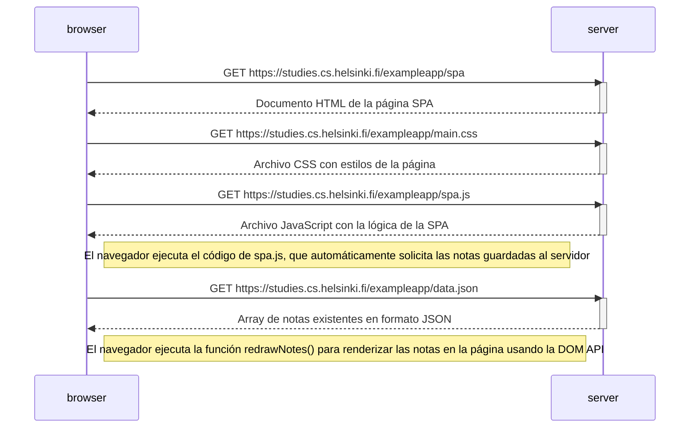

```mermaid
sequenceDiagram
    participant browser
    participant server

    browser->>server: GET https://studies.cs.helsinki.fi/exampleapp/spa
    activate server
    server-->>browser: Documento HTML de la página SPA
    deactivate server

    browser->>server: GET https://studies.cs.helsinki.fi/exampleapp/main.css
    activate server
    server-->>browser: Archivo CSS con estilos de la página
    deactivate server

    browser->>server: GET https://studies.cs.helsinki.fi/exampleapp/spa.js
    activate server
    server-->>browser: Archivo JavaScript con la lógica de la SPA
    deactivate server

    Note right of browser: El navegador ejecuta el código de spa.js, que automáticamente solicita las notas guardadas al servidor

    browser->>server: GET https://studies.cs.helsinki.fi/exampleapp/data.json
    activate server
    server-->>browser: Array de notas existentes en formato JSON
    deactivate server

    Note right of browser: El navegador ejecuta la función redrawNotes() para renderizar las notas en la página usando la DOM API    
```
