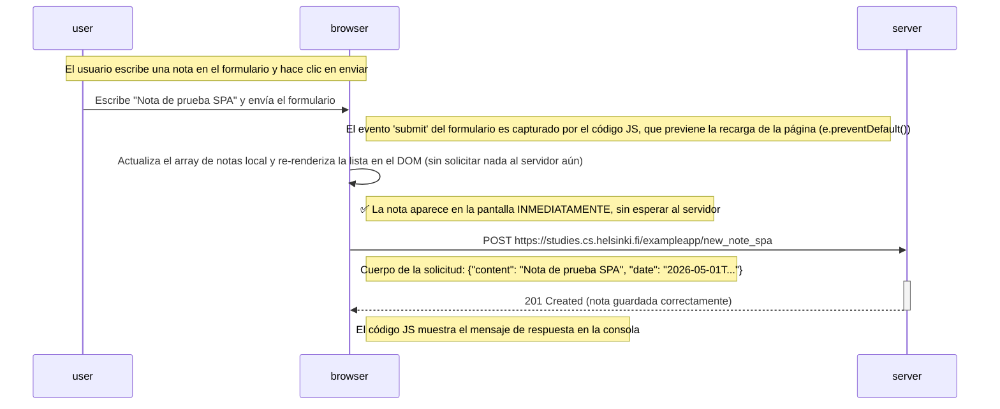

```mermaid
sequenceDiagram
    participant user
    participant browser
    participant server

    Note over user,browser: El usuario escribe una nota en el formulario y hace clic en enviar
    user->>browser: Escribe "Nota de prueba SPA" y envía el formulario
    Note right of browser: El evento 'submit' del formulario es capturado por el código JS, que previene la recarga de la página (e.preventDefault())
    browser->>browser: Actualiza el array de notas local y re-renderiza la lista en el DOM (sin solicitar nada al servidor aún)
    Note right of browser: ✅ La nota aparece en la pantalla INMEDIATAMENTE, sin esperar al servidor
    
    browser->>server: POST https://studies.cs.helsinki.fi/exampleapp/new_note_spa
    note right of browser: Cuerpo de la solicitud: {"content": "Nota de prueba SPA", "date": "2026-05-01T..."}
    activate server
    server-->>browser: 201 Created (nota guardada correctamente)
    deactivate server

    Note right of browser: El código JS muestra el mensaje de respuesta en la consola    
```
