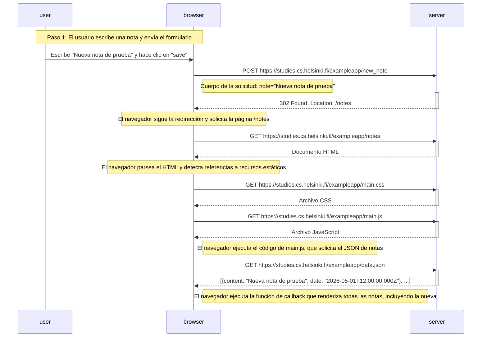

```mermaid
sequenceDiagram
    participant user
    participant browser
    participant server

    note over user,browser: Paso 1: El usuario escribe una nota y envía el formulario
    user->>browser: Escribe "Nueva nota de prueba" y hace clic en "save"
    browser->>server: POST https://studies.cs.helsinki.fi/exampleapp/new_note
    note right of browser: Cuerpo de la solicitud: note="Nueva nota de prueba"
    activate server
    server-->>browser: 302 Found, Location: /notes
    deactivate server

    note over browser: El navegador sigue la redirección y solicita la página /notes
    browser->>server: GET https://studies.cs.helsinki.fi/exampleapp/notes
    activate server
    server-->>browser: Documento HTML
    deactivate server

    note over browser: El navegador parsea el HTML y detecta referencias a recursos estáticos
    browser->>server: GET https://studies.cs.helsinki.fi/exampleapp/main.css
    activate server
    server-->>browser: Archivo CSS
    deactivate server

    browser->>server: GET https://studies.cs.helsinki.fi/exampleapp/main.js
    activate server
    server-->>browser: Archivo JavaScript
    deactivate server

    note right of browser: El navegador ejecuta el código de main.js, que solicita el JSON de notas
    browser->>server: GET https://studies.cs.helsinki.fi/exampleapp/data.json
    activate server
    server-->>browser: [{content: "Nueva nota de prueba", date: "2026-05-01T12:00:00.000Z"}, ...]
    deactivate server

    note right of browser: El navegador ejecuta la función de callback que renderiza todas las notas, incluyendo la nueva

```
